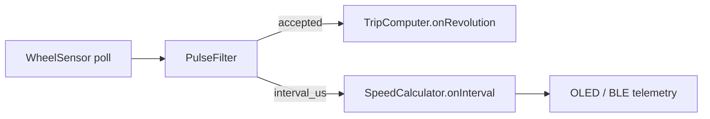

# Защита скорости при пропуске импульсов

## Диагностика (по коду, без логов поездки)

В репозитории нет ride-лога — только [`Log 2026-07-31 02_55_35.txt`](Log 2026-07-31 02_55_35.txt) (BLE pairing). Поведение воспроизводится по текущему пайплайну:



Сейчас в [`firmware/src/app_controller.cpp`](firmware/src/app_controller.cpp) `processPulses()`:

```844:871:firmware/src/app_controller.cpp
while (wheel_sensor_.pop(event)) {
  const PulseDecision decision = pulse_filter_.process(...);
  if (!decision.accepted) continue;
  // ...
  if (!decision.first_pulse) {
    speed = speed_calculator_.onInterval(..., decision.interval_us, ...);
  }
  trip_computer_.onRevolution(..., speed);  // оборот всегда +1
}
```

**Обороты уже имеют приоритет:** каждый *принятый* импульс даёт ровно +1 revolution. Проблема в **отображаемой скорости**: [`SpeedCalculator`](firmware/lib/domain/speed_calculator.cpp) использует сырой `interval_us` между двумя принятыми импульсами.

| Событие | interval_us | Скорость на экране | Обороты |
|---------|-------------|-------------------|---------|
| Пропущен 1 импульс датчиком | ~2× норма | падает (~50%) | −1 оборот (неизбежно) |
| Пропущен импульс, следующий пришёл | длинный → короткий | низкий всплеск → высокий | верно по факту импульсов |
| Дребезг / двойной фронт (debounce отсёк один) | короткий | всплеск вверх | max_speed ловит пик |

Это совпадает с описанием: **«скачет туда-сюда, но высокие значения верные»** — пики соответствуют реальному короткому интервалу, провалы — от искусственно длинного интервала после пропуска.

`PulseFilter` уже отсекает слишком **быстрые** импульсы (`overspeed`), но **не защищает** от слишком **длинных** интервалов на уровне скорости. Сглаживание (`smoothing_window=3`) смягчает, но не убирает одиночный выброс.

## Целевое поведение

1. **Оборот / дистанция / одометр** — без изменений: +1 на каждый accepted pulse (высший приоритет).
2. **Мгновенная скорость** — интервал для расчёта проходит через **gap-коррекцию** (только для speed, не для счётчиков).
3. **max_speed** — обновляется только от скорректированной скорости (не от сырого выброса вниз; вверх — как сейчас, пользователь доверяет высоким значениям).
4. Диагностика: счётчик `speed_interval_corrected` в domain (опционально в Serial `selftest`/diagnostics).

## Реализация

### 1. Новый модуль `speed_interval_guard` (domain, host-testable)

Файлы: [`firmware/lib/domain/speed_interval_guard.h`](firmware/lib/domain/speed_interval_guard.h), [`.cpp`](firmware/lib/domain/speed_interval_guard.cpp)

```cpp
// Псевдокод
uint32_t sanitize(uint32_t interval_us) {
  if (!has_last_) return interval_us;
  // Длинный зазор: вероятно пропущен(ы) импульс(ы) — для SPEED не роняем ниже прошлого ритма
  if (interval_us > last_good_ * 3 / 2) {
    const uint32_t estimated = (interval_us + last_good_ / 2) / last_good_;
    if (estimated > 1) return interval_us / estimated;  // или last_good_ (консервативнее)
    ++corrected_count_;
  }
  // Короткий всплеск после зазора: не даём speed удвоиться
  if (interval_us < last_good_ / 2) {
    ++corrected_count_;
    return last_good_;
  }
  last_good_ = interval_us;
  return interval_us;
}
```

Пороги вынести в константы (или compile-flag `BIKECOMP_SPEED_GAP_NUM=3`, `DEN=2` для 1.5×). `reset()` при сбросе поездки.

### 2. Интеграция в `SpeedCalculator`

В [`speed_calculator.cpp`](firmware/lib/domain/speed_calculator.cpp) вызывать guard **до** записи в `intervals_[]`:

- `const uint32_t effective = guard_.sanitize(interval_us);`
- дальше формула без изменений, но с `effective`
- `reset()` сбрасывает guard

Альтернатива (чище по слоям): вызывать guard в `processPulses` и передавать уже sanitized interval — предпочтительно **внутри SpeedCalculator**, чтобы timeout/smoothing оставались согласованными.

### 3. `processPulses` — явный порядок приоритетов

В [`app_controller.cpp`](firmware/src/app_controller.cpp) переставить для читаемости (поведение то же):

```cpp
trip_computer_.onRevolution(circ, speed);  // оборот первым
// speed уже посчитан из sanitized interval
```

Добавить комментарий: distance/rev не зависят от speed correction.

### 4. Тесты (native)

В [`firmware/test/test_native/test_main.cpp`](firmware/test/test_native/test_main.cpp):

| Тест | Сценарий | Ожидание |
|------|----------|----------|
| `test_speed_gap_long_interval` | 500ms → 1500ms (1 пропуск) | speed ≈ как при 500ms, не 1/3 |
| `test_speed_gap_short_spike` | 500ms → 150ms | speed ≈ 500ms-ритм, не 3× |
| `test_speed_gap_rev_unchanged` | через TripComputer | revolutions +2 при двух accepted |
| `test_speed_gap_reset` | reset после зазора | guard сброшен |

Прогон: `pio test -e native`.

### 5. Документация

Кратко в [`docs/03-firmware-architecture.md`](docs/03-firmware-architecture.md) §6.2: gap-коррекция интервала для speed only; обороты не затрагиваются.

Задача [`tasks/verification/README.md`](tasks/verification/README.md) §7.5 — отметить подпункт про Hall gaps после верификации на велосипеде.

### 6. Верификация на железе (после прошивки)

- Serial: `hall-status` / `selftest` — смотреть `rejected_*`, `isr_ovf` (если overflow растёт — отдельная проблема буфера, не этот фикс).
- Прокат с постоянной скоростью + намеренный зазор магнита: скорость на OLED не должна падать в 2× на один пропуск.
- Сверить `revolutions` с щелчками геркона — без регрессии.

## Что сознательно не меняем в этом инкременте

- `PulseFilter` / debounce / overspeed — работают как есть.
- Не пытаемся «догадывать» пропущенные обороты для одометра (нет физического импульса — нет +1).
- Не трогаем BLE protocol / config fields (коррекция с фиксированными порогами; при необходимости — отдельный config field позже).

## Риски и fallback

- При реальном **резком торможении** длинный интервал может быть честным — guard слегка задержит падение speed на 1–2 импульса. Порог 1.5× и clamp к `last_good` минимизирует это; при `stop_timeout` speed всё равно уйдёт в 0.
- Если после полевых тестов провалы останутся — можно ужесточить до «при gap > 1.5× держать предыдущую speed» без деления интервала.
